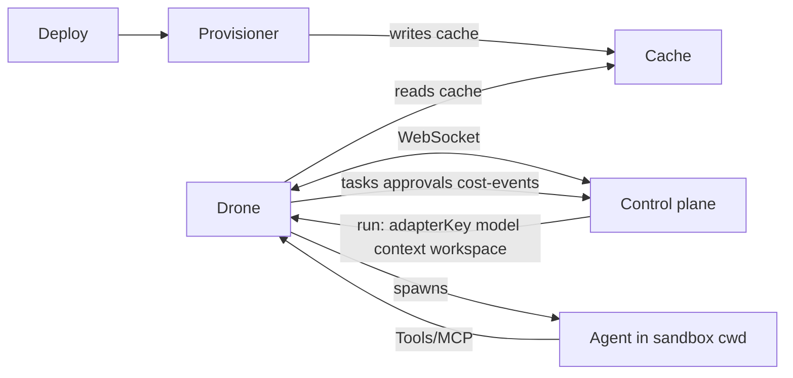

# Automated deployment and run lifecycle

One place to understand the full flow from deploy to run to subagents, with security boundaries explicit. Audience: senior developers and architects implementing or operating Hive with managed workers.

## Scope and audience

**Full automation** means: one-liner (or image) deploy; provisioner sets up runtimes and optional sandbox images; drone runs agents; control plane drives what runs; agents delegate via tools. This doc explains who does what and where the boundaries are. Details (run message shape, provisioner contract, sandbox, tools/API) live in the referenced specs.

## End-to-end flow (phases)

1. **Deploy** — Operator runs one-liner or deploys image (drone + optional provisioner). Drone connects outbound to control plane via WebSocket.

2. **Environment setup** — Provisioner (required for full automation) discovers what to install (manifest or control-plane API), fetches from allowlisted sources with verification, writes to shared cache/install root (when container-based sandboxing is used, provisioner may pre-pull allowlisted sandbox images). Drone only runs from that environment; it does not install from run payload or context.

3. **Run** — Control plane sends run message (agentId, runId, context, adapterKey, optional model, optional workspaceDir when supported). Drone selects allowlisted adapter, optionally runs in policy-driven sandbox, sets cwd when workspace path is provided, passes context (including model) to executor, reports status/log.

4. **Isolation and workspace** — **Sandbox:** policy-driven, default-on; control plane decides, drone enforces; only allowlisted images/runtimes when container-based. **Workspace:** control plane may set context.hiveWorkspace; when run payload includes workspaceDir/workspacePath and drone supports it, drone sets agent cwd.

5. **Model and subagents** — **Model:** set per run manually (user/operator) or autonomously (e.g. by deploying agent or policy); carried in run payload or context; drone passes to executor; executor reports back in status. **Subagents:** agent uses tools/MCP on drone → drone calls control plane API (create task, request hire); when permitted, the agent can run or delegate to other agents; requests can be auto-accepted, approved by CEO agent, or approved by board. "Deploy another agent" = request_hire → approval (auto, CEO, or board) → new agent; delegation = create_task assigned to another agent (agent may run them if permitted).

## Diagram

## Sandboxing (proper isolation)

The **sandbox** is the isolation environment for the agent run — the place where the agent process executes with restricted access. It is not "images inside a container" redundantly; it is the isolation boundary (container, microVM, or equivalent) chosen by the operator.

**Options:**

1. **Container from allowlisted image** — Agent process runs inside a container started from an operator-allowlisted image (minimal OS + tools). The provisioner may pre-pull these images so the drone can start them without pulling at run time.

2. **MicroVM** (e.g. Firecracker, Kata) — Stronger isolation, dedicated kernel per run; suitable for untrusted or high-assurance workloads.

3. **gVisor** — User-space kernel; strong isolation without full VM overhead.

4. **Hardened container** — seccomp, read-only root, capability dropping; adequate only for trusted or controlled code.

**Defense-in-depth:** Combine compute isolation with filesystem boundaries (e.g. read-only root, tmpfs workspace), network isolation, and resource limits (cgroups). For untrusted LLM-generated code, hardened containers alone are inadequate (shared kernel); prefer microVM or gVisor. Industry practice: E2B, Modal, Northflank; MCP security guidance (containerized tool execution, policy gateways).

## Security assumptions and practices

- **Allowlisted adapter keys and sources only** — Run payload and context do not define new installs or images.
- **Sandbox policy and images** — From control plane/operator only; never from run payload or context.
- **Credentials** — Only on the drone; agents do not hold API keys.
- **Agent → control plane** — Agents reach the control plane only via drone tools/MCP; no direct agent–control-plane calls.
- **No secrets in context** — Context is opaque to the drone but must not carry credentials; use worker-mediated API for sensitive operations.

See [DRONE-SPEC.md](DRONE-SPEC.md) §4, §5, and [ACPX-INTEGRATION.md](ACPX-INTEGRATION.md) Security for details.

## Related practices

Hive's model/subagent/approval design is informed by patterns from agent runtimes (e.g. agno governance, scalyclaw guards) and context/session practices (e.g. context-mode, memU). This doc and the referenced specs capture the contract; implementation may evolve to incorporate those patterns where applicable.

## Cross-references

- **Details:** Run message in [DRONE-SPEC.md](DRONE-SPEC.md) §2; provisioning in §4; sandbox in §5; tools/MCP in §7; control-plane API in [SPEC-implementation.md](SPEC-implementation.md) §10 and §11.
- [MANAGED-WORKER-ARCHITECTURE.md](MANAGED-WORKER-ARCHITECTURE.md) — Target architecture (one worker per machine, single adapter).
- [ACPX-INTEGRATION.md](ACPX-INTEGRATION.md) — ACP executor and security.
- [doc/plans/workspace-strategy-and-git-worktrees.md](plans/workspace-strategy-and-git-worktrees.md) — Execution workspace and worktree strategy.
- **Production / k3s + LLM:** [K3S-LLM-DEPLOYMENT.md](K3S-LLM-DEPLOYMENT.md) — Full runbook for k3s, vLLM, model gateway, and worker deployment.
