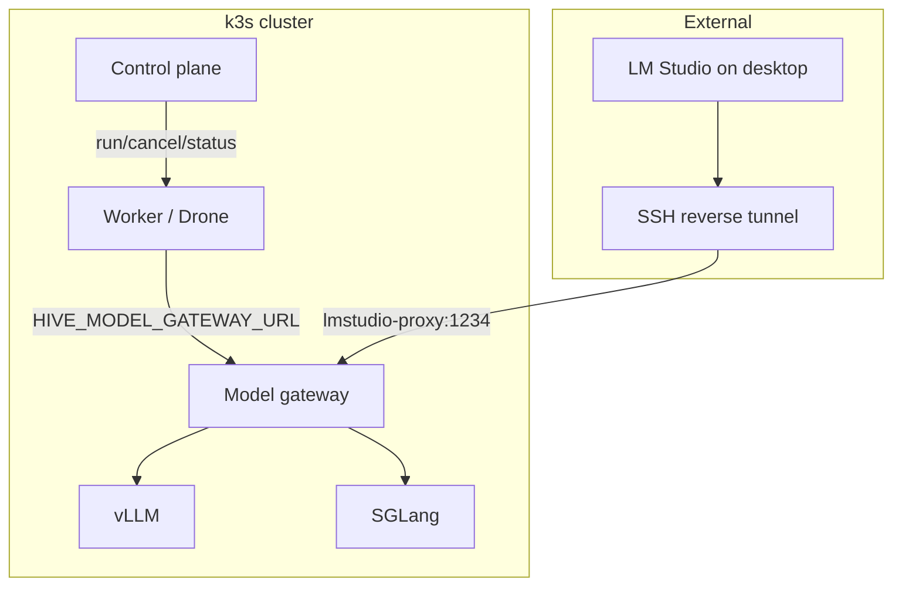

# k3s + LLM deployment

Canonical runbook for deploying Hive on k3s with self-hosted LLMs (vLLM, SGLang, LM Studio), a model gateway, and optional observability. Audience: operators and architects.

**Related:** [AUTOMATED-DEPLOYMENT-AND-RUN-LIFECYCLE.md](AUTOMATED-DEPLOYMENT-AND-RUN-LIFECYCLE.md) (end-to-end flow), [DRONE-SPEC.md](DRONE-SPEC.md) (worker contract), [MANAGED-WORKER-ARCHITECTURE.md](MANAGED-WORKER-ARCHITECTURE.md) (target architecture; **LLM vs MCP**), [MODEL-GATEWAY.md](MODEL-GATEWAY.md) (router contract and policy notes), [Greenfield Bifrost checklist](../../infra/model-gateway/bifrost/GREENFIELD-CHECKLIST.md) (secrets, DB default, sync, metering), [workspace-strategy-and-git-worktrees.md](plans/workspace-strategy-and-git-worktrees.md) (execution workspace).

## Architecture overview



## 1. Base OS and k3s

### OS (all nodes, including GPU)

- **Ubuntu Server LTS (22.04 or 24.04)** with:
  - `containerd` as default runtime (k3s uses it by default).
  - `cgroupv2` enabled (default on recent Ubuntu).

### k3s server (first VPS)

```bash
curl -sfL https://get.k3s.io | sh -s - server \
  --disable traefik \
  --write-kubeconfig-mode 644
```

After install, Traefik is not running; install an ingress controller separately (see Add-ons).

### Join worker nodes (other VPSs, GPU box, optional desktop)

On the server, get the token:

```bash
cat /var/lib/rancher/k3s/server/node-token
```

On each node to join:

```bash
export K3S_URL="https://<SERVER_IP>:6443"
export K3S_TOKEN="$(cat /var/lib/rancher/k3s/server/node-token)"
curl -sfL https://get.k3s.io | sh -
```

Or with positional args (e.g. from `infra/scripts/join-desktop.sh`): `./join-desktop.sh "$K3S_URL" "$K3S_TOKEN"`.

## 2. Add-ons

Install after k3s is up.

- **Ingress / API gateway:** Install Traefik or NGINX Ingress Controller (e.g. Helm: `helm install traefik traefik/traefik` or NGINX Ingress from Kubernetes docs). Choose one; k3s with `--disable traefik` leaves the choice to you.
- **Service discovery / config:** Native k3s; optionally **ExternalDNS** if you manage DNS automatically (doc only; no manifest in this repo).
- **Observability:** **Prometheus + Grafana + Loki** via the existing [kube-prometheus-stack](../../infra/cluster/applications/observability.yaml) ArgoCD application in `infra/cluster/applications/observability.yaml`. Alternatively OpenSearch if you prefer Elasticsearch-style logs.
- **Certs:** **cert-manager** with Let's Encrypt for HTTPS ingress (doc only; install via Helm or upstream docs when needed).

## 3. GPU and node specialization

When a GPU node (e.g. FEVM/FAEX1) is online:

- Install vendor driver and runtime:
  - **NVIDIA:** official driver + **nvidia-container-toolkit**.
  - **AMD:** **ROCm** with containerd integration.
- Label and optionally taint the node:

```bash
kubectl label node <gpu-node> gpu=true
kubectl taint node <gpu-node> dedicated=gpu:NoSchedule
```

- Deploy the device plugin:
  - **NVIDIA:** `kubectl apply -f https://raw.githubusercontent.com/NVIDIA/k8s-device-plugin/master/nvidia-device-plugin.yml`
  - **AMD ROCm:** use `rocm/k8s-device-plugin` Helm chart or YAML from the ROCm repo.

Workloads (e.g. vLLM, SGLang) request `nvidia.com/gpu: 1` or `amd.com/gpu: 1` in `resources.limits` and use `nodeSelector: gpu: "true"` (and tolerations if you tainted).

## 4. Self-hosted LLM stack

### 4.1 LM Studio on desktop

For local dev and experimentation:

- Run LM Studio with the OpenAI-compatible server enabled (default port 1234).
- **Direct:** Point Hive/drone at `http://<desktop-ip>:1234/v1` (e.g. env `HIVE_MODEL_LMSTUDIO_URL` or via model gateway).
- **Secure remote:** From the desktop, create an SSH reverse tunnel to the VPS:

```bash
ssh -R 127.0.0.1:1234:127.0.0.1:1234 user@vps
```

Then in the cluster, use a small **LM Studio proxy** so services can reach it at a stable name (e.g. `http://lmstudio-proxy:1234/v1`). Example manifests: `infra/manifests/llm/lmstudio-proxy.yaml` (Service or minimal proxy Deployment). The model gateway can then list a model with `base_url: http://lmstudio-proxy:1234/v1`.

### 4.2 vLLM in-cluster (primary inference)

vLLM provides high throughput and an OpenAI-compatible API. Example manifest: `infra/manifests/llm/vllm-llama.yaml` (Deployment + Service). Apply when you want in-cluster vLLM:

```bash
kubectl apply -f infra/manifests/llm/vllm-llama.yaml
```

Use GPU nodeSelector and `nvidia.com/gpu` limits when GPU nodes exist; omit for CPU-only.

### 4.3 SGLang (optional, structured output)

For best structured-output performance (JSON tools, workflows), run SGLang alongside vLLM. Example: `infra/manifests/llm/sglang-structured.yaml`. Hive can route structured tool-calling to SGLang and generic chat to vLLM via the model gateway.

## 5. Model gateway

A single OpenAI-compatible entrypoint for Hive: the drone gets one URL (e.g. `HIVE_MODEL_GATEWAY_URL=http://model-gateway:8080/v1`). The gateway routes by model id to backends (LM Studio proxy, vLLM, SGLang, optional cloud).

- **Contract:** HTTP service exposing `/v1/chat/completions` and `/v1/completions`; config (e.g. `models.yaml`) lists `id`, `base_url`, optional `api_key_env`.
- **Deployable:** See `infra/model-gateway/` (k8s manifests; default image is **`hive-model-gateway-go`**), `infra/model-gateway-go/`, and `control-plane/doc/MODEL-GATEWAY.md`.

Deploy the model gateway after vLLM/SGLang (or LM Studio proxy); set `modelGatewayURL` on HiveWorkerPool (or worker env) so workers use it.

**Catalog and virtual keys:** The board stores routes in `inference_models` and can mint **gateway virtual keys** per company. Export JSON for the cluster with `GET /api/companies/{companyId}/inference-router-config` and follow `infra/model-gateway/SYNC-INFERENCE-CONFIG.md`.

**Usage webhook:** Set on the Go router `METERING_URL` to `https://<control-plane>/api/internal/hive/inference-metering` and `METERING_BEARER` to the same secret as the server’s `HIVE_INTERNAL_OPERATOR_SECRET` or `INTERNAL_OPERATOR_SECRET`. Virtual-key clients then get `cost_events` rows with `source: gateway_aggregate` without agent ids.

**Deployment vs company:** Router keys and catalog rows use **deployment** (`hive_deployments`); spend and limits still roll up under **companies**. Use `deployment_id` when you need operator-wide router config; use `company_id` for in-product attribution.

**Policy and pluggable routers:** A **static** ConfigMap remains valid. If operations need richer policy immediately, you may substitute Envoy AI Gateway, Bifrost, Plano, or similar **as long as** workers still see one OpenAI-compatible base URL via `HIVE_MODEL_GATEWAY_URL` and requests still carry a `model` id (see [MODEL-GATEWAY.md](MODEL-GATEWAY.md)). Bifrost: Helm chart `bifrost/helm-charts/bifrost`, operator runbook `infra/model-gateway/BIFROST-INTEGRATION.md`.

**MCP is not the model gateway:** Deploying the model gateway does **not** implement **drone MCP**. **Control-plane tools** (issues, cost, …) use **`hive-worker mcp`** (stdio) → `/api/worker-api/*` with a worker-instance JWT — see [DRONE-SPEC.md](DRONE-SPEC.md) §7. **Indexer search** uses the same stdio MCP surface: the worker proxies **`code.search` / `documents.search`** (and stats tools) to the tenant **HTTP MCP gateway** in front of CocoIndex/DocIndex; see [MANAGED-WORKER-ARCHITECTURE.md](MANAGED-WORKER-ARCHITECTURE.md) (*LLM routing and MCP surfaces*). Optional stacks: `infra/cocoindex-lancedb/`, `infra/docindex-lancedb/`, `HiveIndexer` / `HiveDocIndexer` in the operator.

## 6. Control plane placement

The Hive control plane can run:

- **On the same k3s cluster:** Deploy as a Deployment + Ingress; set `HiveCluster.Spec.ControlPlaneURL` to the internal or public URL (e.g. `https://hive-api.yourdomain.com`).
- **External:** Run control plane elsewhere; point `ControlPlaneURL` at that host. Workers and the operator use this URL for WebSocket and API.

## 7. Drone (worker) on k3s

- **Current pattern:** The Hive operator creates a **Deployment** per HiveWorkerPool (see `infra/cluster/tenants/example/workerpool.yaml`). Replicas are scaled by the pool spec; each pod runs one worker that connects to the control plane via WebSocket.
- **Alternative:** For "one drone per node," use a **DaemonSet** and hostPath workspaces (not managed by the operator today); document as an optional pattern.

**Workspace:**

- Worker uses a workspace root (e.g. `HIVE_WORKSPACE` or a mounted PVC). Each run can use a subdir, e.g. `/<company>/<agent>/<runId>`. When the run is tied to a repo, use git worktrees for isolation; see [workspace-strategy-and-git-worktrees.md](plans/workspace-strategy-and-git-worktrees.md).

**Sandbox:**

- Default: containerd namespaces + hardened pods (RunAsNonRoot, ReadOnlyRootFilesystem, capability drop). The operator-applied worker Deployment already sets a strict SecurityContext.
- Stronger isolation: map Hive sandbox policy to Kubernetes **RuntimeClass** and `securityContext`. Use **gVisor** (runsc) or **Kata Containers** (microVMs) as a RuntimeClass for agent pods when you need stronger isolation than hardened containers.

## 8. Desktop model endpoint (product)

Desired flow: the operator adds a "Desktop model endpoint" (e.g. in the Hive UI) with URL and tag (e.g. `lmstudio:<model-name>`). The model gateway reloads its config (or the control plane pushes it). Implementation of the UI/API for this is out of scope here; document as a future enhancement.

## 9. One-liner install sequence

From `infra/` (or repo root):

1. **Bootstrap k3s server:** `./scripts/bootstrap-vps.sh` (installs k3s with `--disable traefik`).
2. **Join workers (optional):** On each node, set `K3S_URL`, `K3S_TOKEN`, then run the k3s install script (or use `./scripts/join-desktop.sh`).
3. **Storage:** `kubectl apply -k manifests/storage` (from `infra/`; default RustFS + Dragonfly; see `docs/scripts.md` for overlays).
4. **Optional:** Format JuiceFS if used; see `./scripts/format-juicefs.sh`.
5. **Operator and tenants:** Deploy operator (e.g. via ArgoCD from `infra/cluster/applications/`); create tenant with `./scripts/create-tenant.sh`.
6. **LLM (optional):** Apply `infra/manifests/llm/` (vLLM, optional SGLang, optional lmstudio-proxy); deploy model gateway; set `modelGatewayURL` on HiveWorkerPool or worker env.

**Alternative (future):** A Helm-based bundle could install control plane, hive-worker chart, vllm chart, and model-gateway chart from a single repo for a one-repo install. Current path remains ArgoCD/operator + apply manifests.

## 10. FOSS choices summary

| Layer            | Recommended FOSS                    | Notes for Hive on k3s        |
|------------------|-------------------------------------|-------------------------------|
| Orchestrator     | k3s                                 | Lightweight; good on VPS.     |
| Runtime          | containerd                          | Default in k3s.               |
| Ingress          | Traefik or NGINX                    | Install after --disable traefik. |
| Observability    | Prometheus + Grafana + Loki         | kube-prometheus-stack in repo.|
| LLM core         | vLLM                                | High throughput, OpenAI API.  |
| Structured agent | SGLang (optional)                   | Fast structured outputs.      |
| Local dev        | LM Studio, Ollama                   | Easy on desktop.              |
| Strong sandbox   | gVisor or Kata                      | RuntimeClass for isolation.   |

## Cross-references

- [AUTOMATED-DEPLOYMENT-AND-RUN-LIFECYCLE.md](AUTOMATED-DEPLOYMENT-AND-RUN-LIFECYCLE.md) — Deploy, provision, run, sandbox, workspace, model, subagents.
- [DRONE-SPEC.md](DRONE-SPEC.md) — Worker build, config (including `HIVE_MODEL_GATEWAY_URL`), WebSocket, provisioning, sandbox.
- [MANAGED-WORKER-ARCHITECTURE.md](MANAGED-WORKER-ARCHITECTURE.md) — One worker per machine, single adapter, agents via worker.
- [docs/cluster.md](../../docs/cluster.md) — ArgoCD app-of-apps and applications.
- [docs/scripts.md](../../docs/scripts.md) — Script order and usage.
