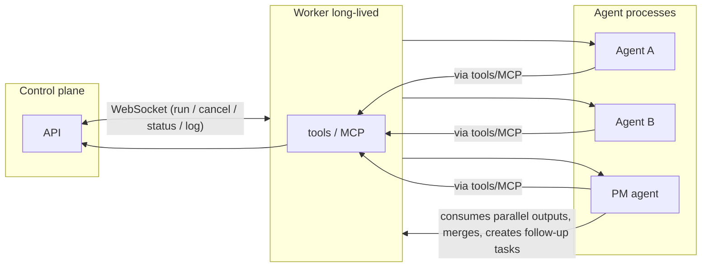

# Managed worker and agent architecture

This document describes how the control plane interacts with **`managed_worker`** agents via **`hive-worker`** (the drone): WebSocket link, enrollment tokens, instance registry, and optional placement. It complements [AUTOMATED-DEPLOYMENT-AND-RUN-LIFECYCLE.md](AUTOMATED-DEPLOYMENT-AND-RUN-LIFECYCLE.md) for the full deploy-to-run story.

**Status (implemented):** The board supports **`managed_worker`** adapters, worker WebSocket dispatch ([ADR 003](adr/003-unified-managed-worker-links.md)), drone-first provisioning ([ADR 004](adr/004-drone-first-provisioning.md)), Workers UI and APIs ([`docs/api/workers.md`](../docs/api/workers.md)), and release/install flows ([`infra/worker/RELEASES.md`](../../infra/worker/RELEASES.md)). Some companies may still use **other** adapter types for non-drone agents; those paths are unchanged.

**Still evolving:** Full automated provisioning of every adapter runtime, richer **placement pools**, and migration of work between hosts without manual re-enrollment are described in plans (e.g. [worker-pool-and-placement.md](plans/worker-pool-and-placement.md)), not fully productized end-to-end.

## Historical note (why multiple adapters existed)

Earlier iterations exposed many adapter types (process, HTTP, claude-local, etc.) so each tool could call the control plane directly. The **managed worker** model centralizes credentials and invocation on **`hive-worker`** for board identities that use it. Other adapter types may remain for legacy or specialist agents.

## Concepts

- **Agent / employee:** A board identity (e.g. COO, engineer) and the **runtime** that runs when work is assigned (memories, tools, models). The board row and the coding process are the same **agent** at different layers — not a separate “slot” distinct from the agent.
- **Drone:** The `hive-worker` process. It is the **harness**: holds credentials, connects to the control plane, and runs or spawns agent workloads on the machine or container where it runs.

### Deployment vs company

**Company** in Hive is an in-product org (issues, agents, spend limits). **`hive_deployments`** is a grouping boundary: every company has a `deployment_id`. Model-router catalog rows and gateway virtual keys are keyed by deployment; `cost_events` stay company- (and agent-) scoped unless you emit aggregates such as `source: gateway_aggregate`. A single control-plane instance often uses one default deployment row for all companies; you can add more deployment rows when operators split config or routing.

### Placement

**Domain split (implemented):** **Fleet** = `worker_instances` (drones). **Identity** = `managed_worker` agents. **Assignment** = `worker_instance_agents` rows, written only via the worker-assignment service — `hello` does not create bindings ([ADR 005](adr/005-fleet-identity-assignment.md)). **Automatic placement** is opt-in: `HIVE_AUTO_PLACEMENT_ENABLED` and `agents.worker_placement_mode = automatic`.

**Optional v1 (feature-flagged):** With `HIVE_PLACEMENT_V1_ENABLED` and migration `run_placements`, the control plane can record which `worker_instances` row a heartbeat run targets, send `expectedWorkerInstanceId` on the WebSocket run message, and have the drone reject mismatches — see [ADR 002](adr/002-placement-registry-option-a.md), [placement-policy-and-threat-model.md](plans/placement-policy-and-threat-model.md), and [DRONE-SPEC.md](DRONE-SPEC.md) §11.

Long-term, agents/employees are **drone-agnostic** across a **pool** (Option B–style workers, shared registry, richer scheduling) — see [worker-pool-and-placement.md](plans/worker-pool-and-placement.md).

## Managed worker: role and responsibilities

- **One long-lived process per machine** (the worker). It can run in a container or outside (e.g. single binary compiled for the target OS).

- **Control plane speaks only to the worker:** commands like "run this", "stop", "status" — and gets back "running" / "done" / "failed".

- **Worker responsibilities:**
  - Spawn, stop, restart CLI agents (one or many; same or different providers).
  - Select model and agent identity per run.
  - Set agent identity, permissions, and access so that when one agent finishes, switching to another is clean.
  - Hold credentials for the control plane; agents do **not** hold API keys.
  - Expose control-plane actions to agents as tools or MCP: agents talk to the control plane **only via the worker** (e.g. "create task", "deploy another agent"). A CEO-style agent can request deploying another agent for a task through the worker.

### Drone as harness

The worker (drone) is the **harness**: the only process that talks to the control plane, holds credentials, and spawns or controls agent processes. Agents run as children (or in containers) of the drone; they do not connect to the control plane. All run, cancel, and status flows go through the drone.

## Single adapter from the control plane's perspective

The control plane has a single "managed worker" (or "hive-worker") adapter. There is no need for process, HTTP, claude-local, codex-local, cursor-local, openclaw_gateway, etc. as separate invocation paths. All invocation and status flows go through the worker.

## Agent communication and tokens

Agents do **not** communicate directly with the control plane. They use the worker as a proxy (tools/MCP). So agents do **not** need to manage API keys.

Token usage is the same or lower than today: one heartbeat/status channel per worker, tool responses can be compact, and there are no duplicate auth flows.

### LLM routing and MCP surfaces (three threads)

Keep these separate when reading deployment docs or choosing infrastructure; conflating them makes the architecture look inconsistent.

1. **LLM inference (OpenAI-compatible):** Workers may set `HIVE_MODEL_GATEWAY_URL` so the executor uses a **single base URL** for all chat/completions traffic; each request carries a **`model` id**, and the router forwards to the right backend (vLLM, SGLang, LM Studio proxy, cloud APIs, or a custom/RL-served endpoint once it exposes an OpenAI-compatible URL). Contract: [MODEL-GATEWAY.md](MODEL-GATEWAY.md). k3s runbook: [K3S-LLM-DEPLOYMENT.md](K3S-LLM-DEPLOYMENT.md). Reference implementation: `infra/model-gateway/`. That router is a **pluggable data plane**; Hive’s long-term **policy** (allowlists, budgets, which models exist) lives in the control plane even if the binary is swapped for a third-party AI gateway that honors the same contract.

2. **Indexer / RAG (HTTP MCP gateway):** CocoIndex is reconciled by **`HiveIndexer`**; DocIndex by **`HiveDocIndexer`** (`infra/operator/controllers/indexer_controller.go`, `docindexer_controller.go`). Each can run a **Hive MCP gateway** (`infra/cocoindex-lancedb/mcp_gateway.py`, image `Dockerfile.gateway`) in front of the indexer API. The gateway validates a **worker-tier** token; the indexer **admin** token never reaches agent processes. For DocIndex gateways, the operator sets **`GATEWAY_DOCINDEX_MODE=1`** so the gateway blocks document indexing tools for workers.

3. **Drone MCP (single stdio surface):** Worker-local **stdio MCP** (`hive-worker mcp`) is the **only** MCP server agents should use (`.mcp.json` → `hive`). JSON-RPC handling defaults to **sequential** (`HIVE_MCP_MAX_CONCURRENT=1` or unset); operators may raise it for bounded concurrent `tools/call` (see [DRONE-SPEC.md](DRONE-SPEC.md) §7). It holds the **worker-instance JWT** for **`/api/worker-api/*`** (issues, cost, …) and **proxies** allowed indexer tools to the HTTP gateway using **`HIVE_MCP_CODE_*` / `HIVE_MCP_DOCS_*`** (and legacy **`HIVE_MCP_URL` / `HIVE_MCP_TOKEN`** for code) from the **worker pod**—not from agent containers. Exposed tool names include **`code.search`**, **`code.indexStats`**, **`documents.search`**, **`documents.indexStats`** when the corresponding gateway env vars are set. Optional **WASM** skills live under **`HIVE_PROVISION_CACHE_DIR/skills/`** (`*.wasm` + `{base}.schema.json`). **Trust:** treat `skills/` as **operator-controlled supply chain** (image build, init containers, or signed bundles only); modules run **in-process** with caps: **`HIVE_WASM_SKILL_TIMEOUT_MS`** (default 30s, max 600s), **`HIVE_WASM_MEMORY_LIMIT_PAGES`** (default 256 pages), **`HIVE_WASM_MAX_STDOUT_BYTES`** (default 2MiB, max 16MiB). Bounds reduce runaway CPU/IO but do not sandbox a malicious operator. See [DRONE-SPEC.md](DRONE-SPEC.md) §7.

**Threat model (summary):** Treat the **agent process as untrusted** (prompt injection). **Secrets and policy** live in the worker process, MCP gateway, and control plane—not in agent-visible env for indexer auth. Container executors intentionally do **not** pass `HIVE_MCP_*` into agent containers; agents rely on stdio MCP to the worker binary only.

**Plugins and compiled tools:** Provisioned runtimes, optional manifest hooks, and future plugin-contributed tools are described in [DRONE-SPEC.md](DRONE-SPEC.md) (provisioning) and [plugins/PLUGIN_SPEC.md](plugins/PLUGIN_SPEC.md). They are independent of which component implements the LLM HTTP router.

### Board vs worker principals and worker-api authorization

**Different trust domains:** Board HTTP APIs accept principals of type **`user`**, **`agent`** (API key), or **`system`**, with company access and roles such as **`instance_admin`** as enforced today. **`/api/worker-api/*`** accepts only a **`worker_instance`** JWT (`kind: worker_instance`); board sessions and agent API keys are rejected with **403**. The drone holds the worker JWT; **`hive-worker mcp`** uses it when proxying tool calls to the control plane. That JWT identifies the **fleet row** (`worker_instances`), not the “current” board user.

**Worker API is route-scoped, not MCP tool RBAC:** Authorization for agent-observable tools that hit the board is implemented as **explicit checks per HTTP route** in [`server/src/routes/worker-api.ts`](../server/src/routes/worker-api.ts), not as a permission matrix keyed by MCP tool name. Typical rules: the body/query **`agentId`** must belong to the JWT’s company and not be **`terminated`** or **`pending_approval`**; the issue must be in the same company; **status transition** requires the agent to be the issue **assignee**; mutations on a checked-out **`in_progress`** issue require **`X-Hive-Run-Id`** consistent with checkout. **`role`** on worker-identity slots and similar fields govern **catalogue / placement / board UX**, not a fine-grained ACL over each MCP capability.

**Indexer tools:** Exposure of dangerous indexer HTTP operations is reduced by the **gateway** (worker token, tool blocklists, optional DocIndex mode)—orthogonal to board “roles.”

### Worker WebSocket authentication

The worker dials `GET /api/workers/link` (see [DRONE-SPEC.md](DRONE-SPEC.md)). The control plane accepts:

1. **Short-lived enrollment token:** A board user calls `POST /api/companies/{companyId}/worker-instances/{workerInstanceId}/link-enrollment-tokens` (**instance-scoped** — one drone row; all board agents bound to that instance share the link after connect). `POST /api/agents/{id}/link-enrollment-tokens` (**agent-scoped**) remains supported for targeted identity pairing and recovery, but it is not the fleet-first operator default. The response includes a one-time plaintext secret (`hive_wen_…`); only a hash is stored. The token expires after a bounded TTL and is **consumed** on the first successful WebSocket upgrade. The Go worker still receives it as `HIVE_AGENT_KEY` (opaque bearer to the link endpoint).

1b. **Drone provisioning token (drone-first bootstrap):** `POST /api/companies/{companyId}/drone-provisioning-tokens` mints `hive_dpv_…`; **consumed** after first **`hello`** that upserts `worker_instances` (see [ADR 004](adr/004-drone-first-provisioning.md)). Worker uses `HIVE_DRONE_PROVISION_TOKEN` without `HIVE_AGENT_ID`. Bind identities afterward via HTTP (`PUT .../worker-instances/.../agents/...`) or automatic placement when enabled ([ADR 005](adr/005-fleet-identity-assignment.md)); **`hello` does not write assignment rows**.

| | Agent-scoped mint | Instance-scoped mint | Drone provisioning |
| --- | --- | --- | --- |
| **When to use** | One identity per process / targeted pairing and recovery | Shared host: one `hive-worker` WebSocket for every board agent bound to the same `worker_instances` row (**default UX**) | Install worker before any board identity exists |
| **HTTP** | `POST /api/agents/{id}/link-enrollment-tokens` | `POST /api/companies/{companyId}/worker-instances/{workerInstanceId}/link-enrollment-tokens` | `POST /api/companies/{companyId}/drone-provisioning-tokens` |
| **Blast radius** | Token grants link for that agent id only | Token grants link for the whole instance row — treat as more sensitive | Token allows registering a new instance for the company — treat as very sensitive |
| **UI** | Workers row **Assign to drone** / agent configure | Workers grouped drone row **Instance link token** | Workers **Generate host bootstrap token** |

2. **Long-lived agent API key:** For automation and machines under your control; revocable; `last_used_at` updated when used for the link.

3. **Push pairing (managed worker):** While a **pairing window** is open for the agent, an operator can run the **`hive-worker`** binary with `pair` (or `HIVE_PAIRING=1` with no token yet). The worker calls anonymous `POST/GET /api/worker-pairing/requests` on the board; after board approval it receives a short-lived enrollment token and connects over the same WebSocket as (1). No Node/pnpm on the host. Pipe installers from `GET /api/worker-downloads/install.sh` / `install.ps1` can set `HIVE_PAIRING=1` to extract the binary and run pairing in one step; see `infra/worker/RELEASES.md`.

### Operator journey (board UI)

1. **Company onboarding (once per company)** creates the company and ensures a COO agent with the `managed_worker` adapter; the worker step mints enrollment and shows install/link commands.
2. After that, operators use **Workers** in the company sidebar (or each agent’s **Configure** / **Overview** tab) for downloads, enrollment tokens, and connection status — the same flow as onboarding, without re-running the wizard. The **Workers** table is **fleet-first**: **drones** (`worker_instances`) with nested **board identities**; **`hive-worker`** holds the WebSocket. Identities appear under a drone after **explicit assignment** (or automatic placement when enabled), not merely because `hello` reported an `instanceId` ([ADR 005](adr/005-fleet-identity-assignment.md)). Golden path: bootstrap drone (`hive_dpv_…`) → assign identity → mint **Instance link token** for steady-state links. **Assign to drone** on an identity row (agent-scoped token) is for one-off identity onboarding or recovery.
3. **API:** `GET /api/companies/{companyId}/drones/overview` returns **`instances`** (drones with nested **`boardAgents`**), **`unassignedBoardAgents`**, and a flat **`boardAgents`** list. **`connected`** remains **best-effort** per API process (in-memory WebSocket registry). See `docs/api/workers.md` for multi-replica behavior and field meanings.

## Parallel agents

The worker can spawn **parallel** agents (multiple agents at once on the same machine). Agents can run in **isolation** (per task/project) or **alongside** each other, as required. Isolation is **policy-driven** (default-on, with policy layers per company, agent, and optionally task) and uses only **allowlisted** images or runtimes; see [doc/DRONE-SPEC.md](DRONE-SPEC.md) §5 for per-run container/sandbox and autosandbox target behavior.

## Handoff and takeover

Handoff and takeover between agents use the **control plane** and **workspace** (e.g. shared context, issue updates, comments). Real-time agent-to-agent messaging is not required for handoff.

## Parallel work on the same project

When multiple agents work on the **same project** in parallel:

- Each agent works in a **separate tree** (branch, worktree, or copy) to avoid filesystem conflict and to avoid needing real-time chat between agents.
- There is no requirement for agents to "talk" to each other during parallel work.

**Synthesis:** A **project manager (PM) agent** runs after the parallel phase. It sees all parallel outputs (trees/artifacts), merges or chooses the best solution, makes any further adjustments, and can create follow-up tasks (e.g. "fix issue in agent B's approach") instead of doing every fix itself.

**Implication for control plane / worker:** Support multiple trees per project when running parallel agents. The PM needs a clear notion of which runs/trees belong to the same parallel batch (e.g. task/run grouping) so it knows what to merge/compare.

## Architecture diagram

## Control plane to worker: WebSocket only

The worker (drone) **connects to the control plane** over a single **WebSocket** (outbound from the drone). Auth at connect (e.g. Bearer in query param or first message). The control plane does not POST to a worker URL; the drone does not expose an HTTP run/cancel API.

**Run**

- Control plane sends a **run** message over the WebSocket (agentId, runId, context, optional adapterKey). Worker responds with acceptance (e.g. ack message) and later sends **status** and **log** messages over the same WebSocket.
- Control plane may use a configurable timeout (e.g. for ack). If the worker does not respond within that time, the control plane may record the run as failed (e.g. timeout error).

**Cancel**

- Control plane sends a **cancel** message over the WebSocket (runId). Worker performs graceful shutdown then force kill if needed and sends final **status** (cancelled).

**Status and logs**

- Worker sends **status** messages (runId, status, exitCode?, error?) and **log** messages (runId, stream, chunk, ts) over the same WebSocket. No HTTP callback or polling.

**Idempotency:** Run messages with the same `runId` may be idempotent (worker returns success without starting a duplicate run). Implementation-defined.

## Out of scope for this doc

Implementation steps and migration from current adapters belong in separate plans or specs. Implementation and API details for the worker (drone)—including WebSocket-only transport, harness role, provisioning, autosandbox, and worktree/workspace behavior—are in [doc/DRONE-SPEC.md](DRONE-SPEC.md) and [doc/ACPX-INTEGRATION.md](ACPX-INTEGRATION.md). For production deployment on k3s with vLLM and a model gateway, see [K3S-LLM-DEPLOYMENT.md](K3S-LLM-DEPLOYMENT.md). Worker pool, placement, and migration (agents drone-agnostic) are scoped in [worker-pool-and-placement.md](plans/worker-pool-and-placement.md).
