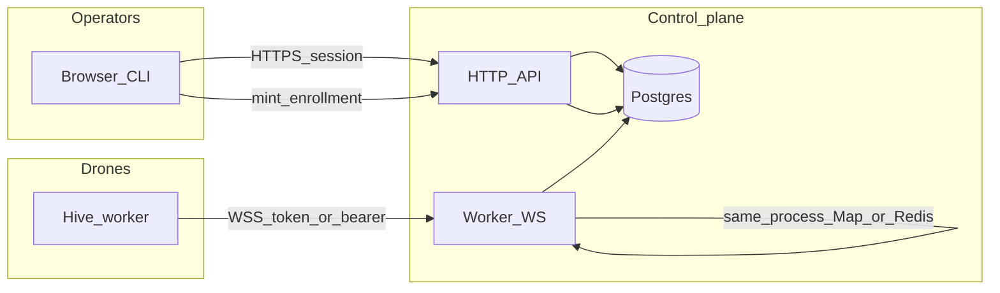

# Threat model: managed worker pool mode (Option B)

**Status:** Living artifact — **ADR 003** implements a **unified** model (single instance-keyed registry; agent- and instance-scoped enrollment converge on the same key).  
**Review gate:** Security or designated owner signs off before enabling **instance-scoped** mint + multi-agent hosts in production.

Companion docs: [authz-matrix-managed-worker-pool.md](./authz-matrix-managed-worker-pool.md), [ADR 003](../adr/003-unified-managed-worker-links.md), [ADR 004](../adr/004-drone-first-provisioning.md) (drone-first bootstrap + dynamic bindings), [ADR 002](../adr/002-placement-registry-option-a.md) (historical Option A placement), [placement-policy-and-threat-model.md](./placement-policy-and-threat-model.md).

## Scope

**Option B** means an instance-scoped WebSocket (one connection per logical drone / `worker_instances` row) that may receive **run** envelopes for **multiple** board `agentId`s bound to that instance via `worker_instance_agents`. Blast radius is **larger** than a hypothetical per-agent-only socket map.

**Unified delivery (implemented):** The control plane does **not** maintain a parallel `Map<agentId>` as the long-term send authority; dispatch resolves `agentId → worker_instance_agents → worker_instances.id` and sends on the instance key, with optional **Redis** fan-out for multi-replica APIs.

This document remains the **threat modeling** artifact for pool mode: trust boundaries, data flow, STRIDE-oriented threats, multi-replica delivery, rollback, residual risk.

## Trust boundaries

- **Operator → API:** Authenticated board/session; mints **hashed** enrollment tokens only in DB.
- **Drone → WS:** Token or API key proves identity; must not cross tenants.
- **API ↔ DB:** All placement and binding queries scoped by `company_id` from authoritative rows — never trust client-supplied instance ids for **authorization**.

## Data flow (pool mode — target)

1. Operator mints **instance-scoped** enrollment (hash stored; plaintext once).
2. Drone opens WebSocket to `/api/workers/link` (path unchanged unless product changes); server verifies token → `worker_instances.id` + `companyId`.
3. Drone sends `hello` (stable `instanceId`, capabilities); server updates `worker_instances` / bindings and an **allow-list epoch** for agents on this instance.
4. Scheduler creates `run_placements` (if placement enabled) and resolves target instance.
5. Dispatch: server sends `run` envelope (`agentId`, `runId`, `placementId`, `expectedWorkerInstanceId`, …) on the **instance** connection (local `Map` or cross-replica bus — below).
6. Drone validates instance id + `agentId ∈ allowList` → `ack` accepted/rejected.
7. Heartbeat / run lifecycle updates run state; cancel uses same path with `cancel` message.

## STRIDE-oriented threats

| ID | Component | Category | Scenario | Mitigation | Test / detection |
| --- | --- | --- | --- | --- | --- |
| PM-01 | WS upgrade | Spoofing | Stolen instance enrollment token used against another company | Token rows scoped to `company_id` + `worker_instance_id`; verify on upgrade; short TTL; rate-limited mint | Integration: path `companyId` vs token company → 403; replay after consume → 401 |
| PM-02 | WS upgrade | Spoofing | Attacker reuses consumed token | Single-use consume (same pattern as `managed_worker_link_enrollment_tokens`) | Integration: second connect fails |
| PM-03 | `run` / `cancel` | Tampering | Worker executes run for `agentId` not bound to this instance | Server sends only valid pairs; **worker** re-checks allow-list + epoch; reject with `placement_mismatch` / `agent_not_allowed` | Unit + integration: forged `agentId` in envelope (if ever client-influenced) → reject |
| PM-04 | Dispatch path | Elevation | Replica R1 holds no socket but assumes local `send()` succeeds | Multi-replica design: Path B (Redis owner + pub/sub) or proven colocation; never silent drop | Integration: worker on R2, dispatch on R1 → explicit failure + retry metric |
| PM-05 | Shared bus | Information disclosure | Run payload on Redis contains secrets or PII | Pass-by-reference: bus carries ids; subscriber loads from DB; no tokens in payload | Code review + grep CI for forbidden keys in publish |
| PM-06 | Placement retry | DoS | Unbounded `next_attempt_at` retries hammer DB or workers | Max attempts, jittered backoff, cap; metrics alert | Load test + counter thresholds |
| PM-07 | Insider | Repudiation / abuse | Board admin mints unlimited enrollment | Audit log on mint; rate limits; optional approval workflow (product) | SIEM on mint activity |
| PM-08 | Cross-tenant | Elevation | Wrong `company_id` on API route | `assertCompanyAccess` + resource belongs to company | AuthZ matrix + fuzz tests ([authz-matrix-managed-worker-pool.md](./authz-matrix-managed-worker-pool.md)) |

Add rows as new surfaces appear (debug APIs, admin placement cancel, etc.).

## Multi-replica delivery (concrete options)

**Problem:** `Map<…>` is per process. If `N > 1` API replicas and **run dispatch** can execute on a replica that does **not** host the drone WebSocket, sticky LB on the WebSocket alone is **insufficient**.

### Path A — Sticky load balancing

- L7 affinity for the worker link upgrade for the lifetime of the connection.
- **Only viable** if every code path that calls `send()` on that socket runs on the **same** replica (hard to guarantee for arbitrary HTTP-driven execute unless architecture forces it).

### Path B — Redis-protocol delivery bus (Redis, Dragonfly, Valkey, or compatible)

1. On connect: set `ws:owner:{workerInstanceRowId}` → `{ replicaId, connectionToken }` with TTL; refresh on ping/`hello`.
2. Dispatching replica R1: GET owner; if self, send locally; else PUBLISH `deliver` with `{ idempotencyKey: placementId, envelopeRef }`.
3. Owning replica R2: load envelope from DB if using pass-by-reference; `ws.send`; dedupe by `idempotencyKey`.
4. On `close`: delete owner key.
5. Redis partition: choose **fail closed** (mark placement failed, alert) or documented degrade — do not leave undefined behavior.

See sequence in internal epic plan (R1 → Redis → R2 → Drone).

**ADR 003** should record which path applies per environment (single replica vs HA).

## Rollback and feature flags (summary)

Full operator steps: [security-runbook.md](../../docs/deploy/security-runbook.md) (section *Managed worker pool mode — rollback*).

| Flag (illustrative) | Purpose | Risk if toggled OFF while in use |
| --- | --- | --- |
| `HIVE_WORKER_POOL_V1_ENABLED` | Pool registry + instance dispatch | In-flight pool-targeted runs may not deliver until drones reconnect with agent-scoped links |
| `HIVE_PLACEMENT_V1_ENABLED` | Placement rows + run fields | Pending placements behavior must be defined (sweeper no-op vs fail closed) |
| `HIVE_AUTO_PLACEMENT_ENABLED` | Server may insert `worker_instance_agents` for `worker_placement_mode=automatic` | Abuse: pool flooding, surprise routing — keep off until labels/drain policy reviewed ([ADR 005](../adr/005-fleet-identity-assignment.md)) |
| `POST .../agents/{id}/worker-pool/rotate` | Board may re-point automatic identities to the next eligible drone | Same blast radius as bind: audit (`worker_instance.agent_pool_rotated`), rate limit with other sensitive company routes; compromised board can churn routing |
| `PATCH .../worker-instances/{id}` + `HIVE_DRAIN_AUTO_EVACUATE_ENABLED` | Drain flag + optional mass rebind of automatic identities | Audit (`worker_instance.updated`); rate limit; no eligible drone leaves automatic identities on draining host until operator rotates or adds capacity |

Database migrations are forward-only; orphaned rows may need a documented admin script after rollback.

## MCP, worker-api, RAG, and indexer gateways

This lane is **orthogonal** to pool placement: the same drone may expose **stdio MCP** to agents while holding a **worker-instance JWT** for `POST/GET /api/worker-api/*` and **gateway bearer tokens** for HTTP MCP to CocoIndex/DocIndex.

**Spec note:** Issue **create**, **patch** (excluding status transitions), and **agent hire** are implemented on **`/api/worker-api/*`** with board-parity checks; **`request_deploy`** remains deferred in [DRONE-SPEC.md §7](../DRONE-SPEC.md). Any process holding **`worker-jwt`** can drive those calls for agents in the JWT’s company — see JWT row below. Mass issue creation or hire spam is constrained by the same **permission** and **sensitive** rate-limit buckets as other worker-api routes. For **401/403** on `/api/worker-api/*` and indexer correlation, use [security-runbook — Alerts: worker MCP and indexers](../../docs/deploy/security-runbook.md).

| Topic | Trust boundary | Risk | Mitigation |
| --- | --- | --- | --- |
| **Worker JWT** | Any process with `worker-jwt` can call worker-api for the JWT’s `company_id` and may name any **`agentId`** in the body that belongs to that company | Stolen file on host, or hostile code in the drone process | Short **TTL** (`HIVE_WORKER_JWT_TTL_*`); protect `HIVE_WORKER_STATE_DIR`; treat drone as single-tenant for that company; rotate **secret** with coordinated API + worker rollout ([security-runbook](../../docs/deploy/security-runbook.md)) |
| **Gateway tokens** (`HIVE_MCP_CODE_*`, `HIVE_MCP_DOCS_*`) | Pod env / Secret; not injected into agent containers by default | Wrong URL → confused deputy across tenants; leaked token → indexer abuse | Operator wiring + **`MCPCodeGateway` / `MCPDocsGateway`** conditions on `HiveWorkerPool`; network policies; rotate gateway Secret with indexer redeploy |
| **RAG / search results** | Content returned to the model | **Prompt injection**, exfil of secrets from indexed repos/docs | **`HIVE_MCP_INDEXER_MAX_TEXT_BYTES`** cap; gateway **blocklists**; org process (review snippets, model policy) — not fully solvable in code alone |
| **WASM `skills/`** | Operator-written modules under cache dir | Malicious wasm burns CPU until timeout; not a strong sandbox | **Operator-only** write path; caps (`HIVE_WASM_*`); prefer signed/provisioned bundles |
| **Stdio MCP** | Single process | Long **code.search** blocks other tools when `HIVE_MCP_MAX_CONCURRENT=1`; **N>1** raises CPU/memory exposure on the worker host | Default sequential; bounded concurrency (see [DRONE-SPEC.md](../DRONE-SPEC.md) §7); WASM serialized when N>1 |

## Residual risks

- **Compromised drone process:** Can attempt to run work for any `agentId` the server sends; mitigations are server allow-list + worker checks + short-lived credentials — not full VM isolation.
- **Compromised board admin:** Can mint enrollment and bind agents; accepted for many products; mitigate with audit logs and least-privilege roles.
- **Shared Redis:** Another service with Redis access could publish fake deliver messages — mitigate with ACLs, logical DB isolation, and optional message signing (future).

## Drone-first provisioning (ADR 004)

**Drone provisioning tokens** authorize a **first** WebSocket link **before** any board identity is bound. Blast radius is **company-wide**: any process that holds the plaintext can register a new `worker_instances` row for that company (after `hello`). Treat like instance-scoped mint: short TTL, strict rate limits, board-only mint, activity logging, and runbook guidance. **Stolen token on host** — attacker could register a rogue drone under the company until the token is consumed or expires; revoke by rotation policy and monitoring `worker_instance` creation. **Dynamic binding** from the board updates `worker_instance_agents` and the in-memory registry without host cooperation — ensure bind/unbind APIs use the same authz as placement and emit audit events.

## References

- [worker-pool-and-placement.md](./worker-pool-and-placement.md)
- [DRONE-SPEC.md](../DRONE-SPEC.md)
- [security-runbook.md](../../docs/deploy/security-runbook.md)
