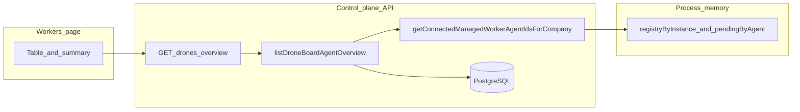

Operators use this API together with [Agents](./agents.md) (`managed_worker` adapter) and the `hive-worker` runtime, which connects over `GET /api/workers/link` (see `doc/MANAGED-WORKER-ARCHITECTURE.md`). The board **Workers** page (`/workers`) is the canonical UI for pairing and enrollment. Fleet-first golden path: bootstrap drone (`hive_dpv_…`) and then use **Instance link token** on the drone row (instance-scoped). **Assign to drone** (agent-scoped token) remains available for targeted identity onboarding/recovery. **Install or deploy hive-worker** opens a side panel (`WorkerDeployHiveWorkerSheet`) with deploy guidance, binary pipe install, and drone-first bootstrap — not inline on the page. Deep-link `#worker-binary-install` opens that panel. The page deep-links with `?enroll={agentId}` (UUID only — no secrets in the URL).

Each **`boardAgents[]` / `unassignedBoardAgents[]` / nested `instances[].boardAgents[]` entry** is a **board agent identity** (scheduler target for runs). **Assignment** to a drone is explicit (`worker_instance_agents`) or automatic when enabled — `hello` alone does not bind identities ([ADR 005](../../doc/adr/005-fleet-identity-assignment.md)). Rows include **`workerPlacementMode`**, **`operationalPosture`**, and **`assignmentSource`** (when bound).

### Board UI: where connection status appears

**Route:** `/workers` (implementation: `ui/src/pages/Workers.tsx`).

The page loads the overview endpoint below and shows:

1. **Summary chips** (when the company has at least one `managed_worker` identity): totals for identities, enrolled drones, identity links currently connected, pending link enrollment tokens, and open pairing requests.
2. **Main table** — **Fleet-first:** each **`instances`** row is a **Drone** block (hostname or stable id, version, placement hints) with two explicit status sections:
   - **Drone health**: `Socket` (node-local transport truth), `Liveness` (derived from socket + recency), and recency timestamps (`Last hello`, `Last seen`, latest identity heartbeat).
   - **Identity linkage**: attached count, linked-now count, and linkage quality (none / partial / full).
   Drone headers include **Request drain** / **Clear drain** (PATCH worker instance; optional auto-evacuation of automatic bindings when **`HIVE_DRAIN_AUTO_EVACUATE_ENABLED`**). Nested rows remain **board identities** with placement, posture, identity socket state, identity liveness, host/build context, and actions. Identities with **`workerPlacementMode: automatic`** show **Rotate pool** (circular advance among eligible non-draining drones). **`unassignedBoardAgents`** lists identities without a **`worker_instance_agents`** row yet.
3. **Deploy hive-worker** (header button) — Side panel with deploy paths, **Binary install** pipe commands, and **Drone-first host bootstrap** (provision token). **Pending drone pairing** (approve/reject) remains on the main page when applicable.

**`connected`** still reflects this process’s in-memory WebSocket registry; UI liveness is an operator aid derived from recency and does not change API contract semantics. See [Multi-instance / load balancing](#multi-instance--load-balancing).

### Implementation reference (code map)

| Layer | Location |
| ----- | -------- |
| Page | `ui/src/pages/Workers.tsx` — summary chips, main table, pairing; **Install or deploy hive-worker** opens `ui/src/components/workers/WorkerDeployHiveWorkerSheet.tsx` |
| Client fetch | `ui/src/api/workers.ts` — `workersApi.overview(companyId)` → `GET /api/companies/{companyId}/drones/overview` |
| Polling | React Query on the overview: `staleTime` 10s, `refetchInterval` 12s (`queryKeys.workers.overview`) |
| Live refresh | SSE (`LiveUpdatesProvider`): `worker.link.connected` / `worker.link.disconnected` (emitted when `/api/workers/link` opens/closes for instance or agent enrollment) and `worker.drone.registered` trigger an immediate **`refetchQueries`** for `workers.overview` so socket state is not stuck until the next poll. Emitted from `server/src/workers/worker-link.ts`. |
| HTTP route | `server/src/routes/agents/list-get.ts` — `assertCompanyAccess(req, companyId)` then `listDroneBoardAgentOverview` |
| Response assembly | `server/src/services/agents.ts` — `listDroneBoardAgentOverview` |
| **Connected** set | `server/src/workers/worker-link.ts` — `getConnectedManagedWorkerAgentIdsForCompany` walks in-memory `registryByInstance` and `pendingByAgent` for `WebSocket.OPEN` connections scoped by `companyId` |
| **`last_seen_at` on reconnect** | `touchWorkerInstanceLastSeenAt` in `server/src/workers/worker-hello.ts` — called when an **instance** link WebSocket opens so `lastSeenAt` is not stuck at the last `hello` if the worker reconnects without sending `hello` again. Metadata `lastHelloAt` still updates only on `hello`. |

**Trust boundary:** The route is company-scoped; the payload never mixes companies.

**Reconnect without manual token rotation:** On an open worker WebSocket, after drone-first **`hello`** completes (or on connect with an instance enrollment token), the server may send **`{ "type": "link_token", "token": "hive_wen_…", "expiresAt": "…" }`**. `hive-worker` persists that secret under **`link-token`** in **`HIVE_WORKER_STATE_DIR`** (or the default config dir). **Env precedence for the dial secret:** **`HIVE_AGENT_KEY`** and **`HIVE_CONTROL_PLANE_TOKEN`** first (so a pasted token is not shadowed by an old file), then **`link-token`**, then **`HIVE_DRONE_PROVISION_TOKEN`** — so the one-time **`hive_dpv_…`** is not reused after consumption when a **`link-token`** exists.

**Instance rows:** Every `worker_instances` row for the company appears in **`instances`**, including **drone-first** hosts with **no** bound identity yet (`boardAgents: []`). Each instance includes **`connected`** (open WebSocket for that instance on this API process). Nested **`boardAgents`** are still only `managed_worker` identities bound to that instance.



**Related (same `/workers` route, not the overview table):** `WorkerDeployHiveWorkerSheet` composes `DeployHiveWorkerGuideContent`, `WorkerQuickInstallCard`, and `WorkerDroneBootstrapSection`. Pairing list via `listPairingRequests`. Live invalidation of worker queries may come from `ui/src/context/LiveUpdatesProvider.tsx` on realtime events.

## List drone / board-agent overview (company)

```
GET /api/companies/{companyId}/drones/overview
```

Same **company access** rules as `GET /api/companies/{companyId}/agents`.

Returns every **`worker_instances`** row for the company (drones), every **non-terminated** `managed_worker` agent, grouping bound identities under **`instances`**, unbound identities under **`unassignedBoardAgents`**, plus a flat **`boardAgents`** list.

**Response (shape):**

```json
{
  "instances": [
    {
      "id": "uuid",
      "stableInstanceId": "uuid-from-hive-worker-hello",
      "hostname": "build-01",
      "version": "0.1.0",
      "os": "linux",
      "arch": "amd64",
      "lastHelloAt": "2025-03-20T12:00:00.000Z",
      "lastSeenAt": "2025-03-20T12:00:00.000Z",
      "connected": true,
      "labels": {},
      "drainRequestedAt": null,
      "capacityHint": null,
      "boardAgents": [
        {
          "agentId": "uuid",
          "name": "COO",
          "urlKey": "coo",
          "status": "idle",
          "connected": true,
          "lastHeartbeatAt": "2025-03-20T12:00:00.000Z",
          "pendingEnrollmentCount": 0,
          "drone": {
            "hostname": "build-01",
            "os": "linux",
            "arch": "amd64",
            "version": "0.1.0",
            "instanceId": "550e8400-e29b-41d4-a716-446655440000",
            "lastHelloAt": "2025-03-20T12:00:00.000Z"
          },
          "workerInstanceId": "uuid",
          "workerPlacementMode": "manual",
          "operationalPosture": "active",
          "assignmentSource": "manual"
        }
      ]
    }
  ],
  "unassignedBoardAgents": [],
  "boardAgents": []
}
```

| Field | Meaning |
| ----- | ------- |
| `instances` | One row per `worker_instances` for the company; **`connected`** is WebSocket state for that drone on this process. **`boardAgents`** may be empty until identities are bound. |
| `unassignedBoardAgents` | Identities with **no** `worker_instance_agents` row yet (not assigned to a drone). |
| `boardAgents` | **Flat** list: `unassignedBoardAgents` first, then every nested agent in `instances` (same objects). |
| `labels` / `drainRequestedAt` / `capacityHint` | Placement prep on `worker_instances` (operator metadata). |
| `connected` (on each **nested** board agent) | Node-local socket truth: whether **this API process** has an **open** WebSocket for that identity on `/api/workers/link`. |
| `connected` (on each **instance** object) | Node-local socket truth: whether **this API process** has an **open** WebSocket for that worker instance row (same caveats as [Multi-instance](#multi-instance--load-balancing)). |
| `pendingEnrollmentCount` | Count of **unconsumed**, **unexpired** link enrollment token rows for that agent (metadata only; no secrets). |
| `lastHeartbeatAt` | From the agent record; may be null if the agent has never heartbeated. |
| `drone` | Last **hello** metadata merged on the agent row; may be null if never received. |
| `workerInstanceId` | FK to `worker_instances.id` when bound. |
| `workerPlacementMode` | `manual` or `automatic` — whether the server may pick a drone when unassigned (`HIVE_AUTO_PLACEMENT_ENABLED`). |
| `operationalPosture` | `active`, `archived`, `hibernate`, or `sandbox` — scheduling gates (see ADR 005). |
| `assignmentSource` | `manual` or `automatic` when bound; `null` if unassigned. |

## Worker provisioning manifest (runtime/tool bootstrap)

```
GET /api/worker-downloads/provision-manifest
```

Returns the **instance-global** provisioning manifest when configured on the server (`HIVE_WORKER_PROVISION_MANIFEST_JSON` / `HIVE_WORKER_PROVISION_MANIFEST_FILE`).

```
GET /api/companies/{companyId}/worker-runtime/manifest
```

Returns the **effective** manifest for that company: if the company has `workerRuntimeManifestJson` set (via `PATCH /api/companies/{companyId}`), that JSON is returned; otherwise the same global source as `worker-downloads/provision-manifest` is used.

**Authorization** (any one):

- Board user with access to `companyId`, **or**
- Agent principal whose `company_id` is `companyId`, **or**
- `Authorization: Bearer <hive_dpv_…>` for an **unconsumed**, unexpired drone provisioning token for that company (bootstrap before first `hello`).

For `HIVE_PROVISION_MANIFEST_URL`, the worker sends `Authorization: Bearer …` when `HIVE_PROVISION_MANIFEST_BEARER` is set, or reuses link credentials (`HIVE_AGENT_KEY`, `HIVE_CONTROL_PLANE_TOKEN`, persisted `link-token`, or `HIVE_DRONE_PROVISION_TOKEN`) so company-scoped URLs work without a separate secret.

- `404` when no manifest source is configured.
- `500` when configured manifest JSON/file is invalid.
- Subject to **sensitive** API rate limits when rate limiting is enabled.

Payload shape:

```json
{
  "version": "v1",
  "adapters": {
    "codex": {
      "url": "https://artifacts.example.com/codex-linux-amd64.tar.gz",
      "sha256": "hex-optional"
    }
  },
  "aptPackages": ["curl", "jq"],
  "npmGlobal": ["typescript@5"],
  "dockerImages": ["docker.io/library/alpine:3.20"]
}
```

`aptPackages`, `npmGlobal`, and `dockerImages` are optional. They are validated on the server when stored on the company; **`hive-worker`** applies them only when **`HIVE_PROVISION_MANIFEST_HOOKS=1`** at process start (requires a non-distroless image with `apt-get` / `npm` / `docker` on `PATH` as needed).

**Optional signing:** When the server is configured with **`HIVE_WORKER_PROVISION_MANIFEST_SIGNING_KEY_FILE`** (or **`HIVE_WORKER_PROVISION_MANIFEST_SIGNING_KEY`**), responses include **`X-Hive-Manifest-Signature: v1-ed25519-<base64>`** over the exact UTF-8 JSON body. **`hive-worker`** should set **`HIVE_PROVISION_MANIFEST_PUBLIC_KEY`** to verify manifests from `HIVE_PROVISION_MANIFEST_URL` (fail closed when the key is set and the header is missing or invalid). See [security runbook](../deploy/security-runbook.md#provision-manifest-signing-optional-ed25519).

## Worker identity automation (board)

Desired-state **catalogue** for `managed_worker` identities per company. When **`HIVE_WORKER_IDENTITY_AUTOMATION_ENABLED`** is not `false`, the control plane creates agents up to each slot’s **`desired_count`** (non-terminated rows keyed by `worker_identity_slot_id`). Scale-down does **not** terminate agents automatically.

- **`GET /api/companies/{companyId}/worker-identity-slots`**
- **`POST /api/companies/{companyId}/worker-identity-slots`** — JSON: `profileKey` (lowercase slug), `displayNamePrefix`, `desiredCount`, optional `workerPlacementMode`, `operationalPosture`, `adapterConfig`, `runtimeConfig`, `role`, `enabled`
- **`PATCH /api/companies/{companyId}/worker-identity-slots/{slotId}`**
- **`DELETE /api/companies/{companyId}/worker-identity-slots/{slotId}`** — rejected if non-terminated agents still reference the slot
- **`GET /api/companies/{companyId}/worker-identity-automation/status`** — slot counts, unbound automatic `agentId`s, server automation flag

After provision **`hello`** and on a periodic timer ( **`HIVE_WORKER_AUTOMATION_RECONCILE_INTERVAL_MS`**, default 5 minutes), the server runs **identity reconcile** then **automatic placement** (`HIVE_AUTO_PLACEMENT_ENABLED`).

## Drone auto-deploy profile (board)

- **`GET /api/companies/{companyId}/drone-auto-deploy/profile?target=docker|k3s`** — JSON env/URL contract for operators; uses configured public API base URL or request `Host` / `X-Forwarded-*`.

See [`infra/worker/auto-deploy/README.md`](../../../infra/worker/auto-deploy/README.md).

## Worker tool bridge (agent)

Narrow HTTP surface for **`hive-worker`** (or adapters) to invoke a **small allowlisted** set of control-plane actions using the same **agent** credentials as the rest of the API (`Authorization: Bearer` agent API key or agent JWT).

```
POST /api/worker-tools/bridge
Content-Type: application/json

{ "action": "cost.report", "input": { ... } }
```

- **`HIVE_WORKER_TOOL_BRIDGE_ALLOWED_ACTIONS`** — comma-separated action ids on the **server**. If empty or unset, the endpoint responds **`503`** (bridge disabled).
- **Principal:** **`agent` only** (board users get **`403`**).
- **Actions** (when allowlisted): `cost.report` (body matches [cost event create](./costs.md) fields; `agentId` is forced from the token), `issue.appendComment` (`input.issueId`, `input.body`; enforces checkout/run ownership the same way as issue comments when the issue is `in_progress` for that agent), `issue.transitionStatus` (`input.issueId`, `input.status`; **assignee must be the calling agent**; same checkout/run rule when the issue is `in_progress` for that agent), `issue.get` (`input.issueId` — UUID or identifier; read-only summary for issues in the agent’s company).

**200** `{ "ok": true, "result": { ... } }`. Errors use standard HTTP status codes. Successful calls emit activity **`worker.tool_bridge`** (action id in details; no comment bodies).

### Multi-instance / load balancing

The link registry is **in-memory per server process**. If you run multiple API replicas **without** sticky sessions or a shared registry, `connected` may be **false on one replica** while the worker is actually connected to another. Prefer observing connection state from the same instance that terminates WebSockets, or treat `connected` as best-effort until a shared signal (e.g. future worker heartbeat row) exists.

Enrollment tokens and agent lists still come from **PostgreSQL** and are consistent across replicas.

### Security

- Response contains **no** enrollment plaintext or API keys.
- Minting tokens: `POST /api/agents/{agentId}/link-enrollment-tokens` (see [Agents](./agents.md)), or instance-scoped mint below.

## Mint instance link enrollment token (board)

Use when a **single** `hive-worker` process should enroll the WebSocket for a **`worker_instances` row** (shared host / multi–board-agent binding). Same TLS and cookie rules as other company routes.

```
POST /api/companies/{companyId}/worker-instances/{workerInstanceId}/link-enrollment-tokens
Content-Type: application/json

{ "ttlSeconds": 900 }
```

- `ttlSeconds` optional (default 900), range 120–3600 — same as agent-scoped mint.
- **Board** principal with `assertCompanyAccess` to `companyId`; service enforces the instance belongs to the company.
- Returns **201** with `{ "token": "hive_wen_…", "expiresAt": "..." }` — plaintext once; hash stored; **consumed** on first successful WebSocket upgrade to `/api/workers/link`.

**Agent-scoped vs instance-scoped:** Agent mint ties the secret to one **board agent** identity. Instance mint ties the secret to one **drone** row; after connect, runs for **every** agent in `worker_instance_agents` for that instance use that link — **larger blast radius**. See `doc/MANAGED-WORKER-ARCHITECTURE.md`.

## Mint drone provisioning token (board)

Bootstrap a host **without** a board identity: token is `hive_dpv_…`, consumed on **first successful `hello`** after WebSocket connect (not at upgrade). **High blast radius** — company-wide host attachment.

```
POST /api/companies/{companyId}/drone-provisioning-tokens
Content-Type: application/json

{ "ttlSeconds": 900 }
```

- Returns **201** with `{ "token", "expiresAt" }`. Worker sets `HIVE_DRONE_PROVISION_TOKEN` (and `HIVE_CONTROL_PLANE_URL`); see `infra/worker/RELEASES.md`.
- **One-step install:** POSIX: `curl -fsSL '…/install.sh' | HIVE_DRONE_PROVISION_TOKEN='…' bash`; PowerShell: `$env:HIVE_DRONE_PROVISION_TOKEN='…'; irm '…/install.ps1' | iex`. The script bakes the board origin from the request and sets `HIVE_CONTROL_PLANE_URL` for the worker when unset — duplicate the URL in env only if the worker must hit a different API base than the install URL. Treat the token like a password — do not paste into logs or chat.

## Bind / unbind board agent to worker instance (board)

Attach or remove a `managed_worker` identity ↔ `worker_instances` row from the API (updates in-memory link registry without host SSH).

```
PUT /api/companies/{companyId}/worker-instances/{workerInstanceId}/agents/{agentId}
```

```
DELETE /api/companies/{companyId}/worker-instances/agents/{agentId}
```

- **204** on success. `PUT` upserts `worker_instance_agents`; `DELETE` removes the binding for that agent.

## Patch worker instance (board)

Update operator metadata on a **`worker_instances`** row: **labels**, **capacity hint**, **display label**, and **drain**.

```
PATCH /api/companies/{companyId}/worker-instances/{workerInstanceId}
Content-Type: application/json
```

Body (at least one field):

- `drainRequested` — `true` sets `drain_requested_at` to now; `false` clears it.
- `labels` — replaces the JSON object (placement tags, e.g. `{ "region": "us-east", "sandbox": true }`).
- `capacityHint` — string or `null`.
- `displayLabel` — string or `null`.

**200** response includes the updated row (`drainRequestedAt` ISO string, etc.) and, when the server transitions from **not draining → draining** and **`HIVE_DRAIN_AUTO_EVACUATE_ENABLED=true`**, optional **`drainEvacuation`**: `{ "evacuatedAgentIds": [...], "skippedAgentIds": [...] }` for identities with **automatic** assignment that were moved or could not be moved (no eligible target).

Activity: **`worker_instance.updated`** with patch details and evacuation summary.

**Workers UI:** **Request drain** / **Clear drain** on each drone row.

## Rotate automatic pool placement (board)

For agents with **`worker_placement_mode = automatic`**, advance binding to the **next** eligible drone in a fixed circular order (same eligibility rules as automatic placement: company, not draining, `placementRequiredLabels`, sandbox posture). If the agent is **unassigned** and at least one eligible drone exists, performs the first automatic bind.

```
POST /api/companies/{companyId}/agents/{agentId}/worker-pool/rotate
```

- **200** with `{ "rotated": true|false, "fromWorkerInstanceId": "…"|null, "toWorkerInstanceId": "…"|null }`. When there is only one eligible drone, `rotated` may be **false** and both ids equal the current binding.
- **Board** + `assertCompanyAccess`. Emits activity **`worker_instance.agent_pool_rotated`** when `rotated` is true. Structured log / Prometheus label **`placement_mobility`** when applicable.

## Worker binary downloads (board session or public install URL)

```
GET /api/worker-downloads/
```

Returns JSON: `tag`, `source` (`manifest` | `github`), `artifacts[]` (`filename`, `url`, optional `sha256`, platform/arch labels), optional `sha256sumsUrl`, `releasesPageUrl`, and **`workerDeliveryBusConfigured`** (boolean) — `true` when this server process has `HIVE_WORKER_DELIVERY_BUS_URL` set (cross-replica worker WebSocket delivery). Install scripts `GET /api/worker-downloads/install.sh` and `install.ps1` use the same payload; when an artifact includes `sha256`, the script verifies the download unless `HIVE_WORKER_SKIP_SHA256=1`.

See [Worker deployment matrix](../deploy/worker-deployment-matrix.md).

### Breaking change (naming refactor)

Removed: `GET .../workers/overview`, root keys `agents` / `unassignedAgents`, nested `instances[].agents`, `POST .../worker-enrollment-tokens`. Use the paths and field names above.
